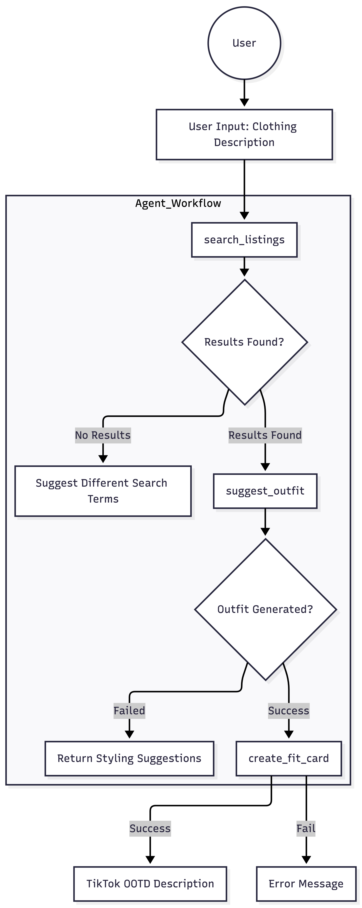

# FitFindr — planning.md

> Complete this document before writing any implementation code.
> Your spec and agent diagram are what you'll use to direct AI tools (Claude, Copilot, etc.) to generate your implementation — the more specific they are, the more useful the generated code will be.
> Your planning.md will be reviewed as part of your submission.
> Update it before starting any stretch features.

---

## Tools

List every tool your agent will use. For each tool, fill in all four fields.
You must have at least 3 tools. The three required tools are listed — add any additional tools below them.

### Tool 1: search_listings

**What it does:**
<!-- Describe what this tool does in 1–2 sentences -->
This tool takes in the following input parameters and return back the best fitted listing from the database. Return the top 3 most relevant listings.

**Input parameters:**
<!-- List each parameter, its type, and what it represents -->
- `description` (str): description of what kind of clothing user wants. Example "graphic tee"
- `size` (str): size of the clothing. Example "M"
- `max_price` (float): max price of the clothing. Example 30, if the user asks for 30 max. Don't return a piece of cloth that's over this price range.

**What it returns:**
<!-- Describe the return value — what fields does a result contain? -->
Result will be a list containing the 3 most relevant items 
For example
```
[
    {
      "id": "TEST_001",
      "title": "asdfghjkl shirt",
      "description": "lorem ipsum blah blah test test 123 ignore this",
      "category": "tops",
      "style_tags": ["test", "fake", "ignore"],
      "size": "XYZ",
      "condition": "excellent",
      "price": 0.01,
      "colors": ["neon green", "radioactive purple"],
      "brand": "FAKEBRAND",
      "platform": "depop"
    },
    {
      "id": "TEST_002",
      "title": "zzzzz pants placeholder",
      "description": "DO NOT USE — test data only qwerty 999",
      "category": "bottoms",
      "style_tags": ["garbage", "placeholder", "delete me"],
      "size": "99999",
      "condition": "fair",
      "price": 999.99,
      "colors": ["chartreuse"],
      "brand": null,
      "platform": "poshmark"
    },
    {
      "id": "TEST_003",
      "title": "foo bar jacket",
      "description": "test test test this is not a real listing abc123",
      "category": "outerwear",
      "style_tags": ["test"],
      "size": "M",
      "condition": "good",
      "price": 12.34,
      "colors": ["beige"],
      "brand": "NULL BRAND CO",
      "platform": "thredUp"
    }
  ]
```
**What happens if it fails or returns nothing:**
<!-- What should the agent do if no listings match? -->
Agent should suggest what the user do next, do NOT call the next tool suggest_outfit

---

### Tool 2: suggest_outfit

**What it does:**
<!-- Describe what this tool does in 1–2 sentences -->
Suggest an outfit to the user based on the request clothing and what's in user's wardrobe.

**Input parameters:**
<!-- List each parameter, its type, and what it represents -->
- `new_item` (dict): Most relevant item from search_listing
- `wardrobe` (dict): Items in user's wardrobe currently

**What it returns:**
<!-- Describe the return value -->
Outfit suggestion based on the new_item and what's currently existing in user's wardrobe. 

**What happens if it fails or returns nothing:**
<!-- What should the agent do if the wardrobe is empty or no outfit can be suggested? -->
If there are nothing in the wardrobe provide styling suggestions for the new item.

---

### Tool 3: create_fit_card

**What it does:**
<!-- Describe what this tool does in 1–2 sentences -->
Based on the outfit suggestion or styling suggestion from suggest_outfit and the new piece of clothing create a 2 - 4 sentence tiktok description in OOTD format that's casual.

**Input parameters:**
<!-- List each parameter, its type, and what it represents -->
- `outfit` (str): The outfit suggestion from suggest_outfit tool call 
- `new_item` (dict): The most relevant item from search_listing tool call


**What it returns:**
<!-- Describe the return value -->
Returns 2 - 4 sentence tiktok description in OOTD format (casual)

**What happens if it fails or returns nothing:**
<!-- What should the agent do if the outfit data is incomplete? -->
Return descriptive error message telling the user where did the agent fail to retreive information.

---

### Additional Tools (if any)

<!-- Copy the block above for any tools beyond the required three -->

---

## Planning Loop

**How does your agent decide which tool to call next?**
<!-- Describe the logic your planning loop uses. What does it look at? What conditions change its behavior? How does it know when it's done? -->
When user enters a descriptive message about a specific piece of clothing it should always call search_listings() first to see if there are any avaliable clothings that matches the description. 

If search_listing correctly returns it will return three results with most relevant item at the top, agent should get the most relevant clothing from the list that's returned and proceed to suggest_outfit() tool call with the most relevant item from search_listings() and user's wardrobe. 

If user's wardrobe is empty before calling suggest_outfit(), return suggestion on how to style the item that was picked. 

If search_listing returns empty or the tool call failed, agent should suggest what the user should tell user what to try differently and stop tool call chain, waiting for next input.

If suggest_outfit correctly returns, agent should then proceed to call create_fit_card() with the outfit suggestion from suggest_outfit and most relevant item from search_listings(). 

If suggest_outfit tool call failed, tell user what to try differently and stop tool call chain, waiting for next input. 

If create_fit_card() was successful, the final output to the user should be 2 - 4 sentence tiktok OOTD description that's casual with the item fields like name, description, price, size etc. 

If create_fit_card fails or return nothing, return descriptive error message telling user where agent failed to retreive information.

---

## State Management

**How does information from one tool get passed to the next?**
<!-- Describe how your agent stores and accesses state within a session. What data is tracked? How is it passed between tool calls? -->
The data will be stored in memory with variables, if this doesn't work out we can use Langgraph to manage a state graph.

---

## Error Handling

For each tool, describe the specific failure mode you're handling and what the agent does in response.

| Tool | Failure mode | Agent response |
|------|-------------|----------------|
| search_listings | No results match the query | returns empty list |
| suggest_outfit | Wardrobe is empty | returns string, suggestion on how to styple the top most item in search_listings|
| create_fit_card | Outfit input is missing or incomplete | return descriptive error message telling the user which call failed. |

---

## Architecture

<!-- Draw a diagram of your agent showing how the components connect:
     User input → Planning Loop → Tools (search_listings, suggest_outfit, create_fit_card)
                                                                          ↕
                                                                   State / Session
     Show what triggers each tool, how state flows between them, and where error paths branch off.
     ASCII art, a Mermaid diagram (https://mermaid.js.org/syntax/flowchart.html), or an embedded
     sketch are all fine. You'll share this diagram with an AI tool when asking it to implement
     the planning loop and each individual tool. -->




---

## AI Tool Plan

<!-- For each part of the implementation below, describe:
     - Which AI tool you plan to use (Claude, Copilot, ChatGPT, etc.)
     - What you'll give it as input (which sections of this planning.md, your agent diagram)
     - What you expect it to produce
     - How you'll verify the output matches your spec before moving on

     "I'll use AI to help me code" is not a plan.
     "I'll give Claude my Tool 1 spec (inputs, return value, failure mode) and ask it to implement
     search_listings() using load_listings() from the data loader — then test it against 3 queries
     before trusting it" is a plan. -->

**Milestone 3 — Individual tool implementations:**
I'll give Calude my Tool 1 spec, implement it myself and ask it to validate the tools.

**Milestone 4 — Planning loop and state management:**
I'll give Calude my planning spec, implement it myself and ask it to validate if the logic is correct.

---

## A Complete Interaction (Step by Step)

Write out what a full user interaction looks like from start to finish — tool call by tool call. Use a specific example query.

**Example user query:** "I'm looking for a vintage graphic tee under $30. I mostly wear baggy jeans and chunky sneakers. What's out there and how would I style it?"

**Step 1:**
<!-- What does the agent do first? Which tool is called? With what input? -->
The agent should first use search_listings("vintage graphic tee", max_price=30) tool with the description and max_price given by the user. Returns the 3 most relevent item that fits the description

**Step 2:**
<!-- What happens next? What was returned from step 1? What tool is called now? -->
Then agent will pick the top most relevant item, then call tool suggest_outfit(newitem=<most relevant item>, wardrobe=<user's wardrobe>), this returns either outfit suggestions or offer styling advice 

**Step 3:**
<!-- Continue until the full interaction is complete -->
Then the agent will call tool create_fit_card(outfit=<suggestion from step 2>, newitem=<most relevant item>) and output out fit of the day type of caption for tiktok

**Final output to user:**
<!-- What does the user actually see at the end? -->
The user at the end should see a out fit of the day caption for tiktok